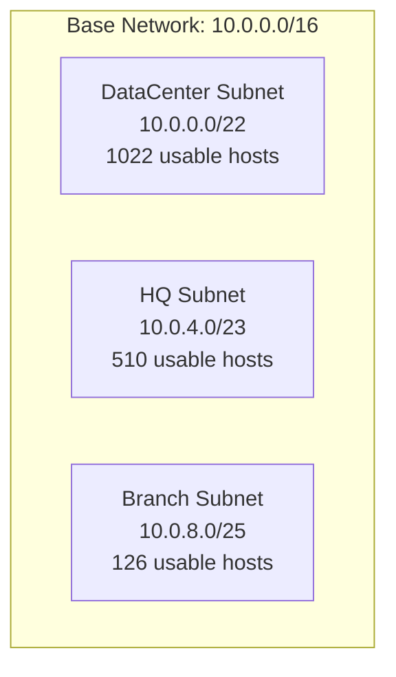
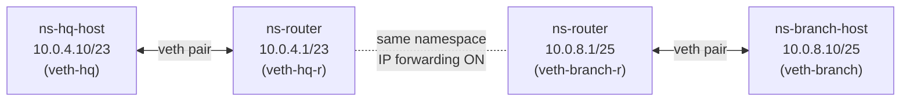

# Project 1: Subnet Design (VLSM) — Linux Hands-On Lab

**Status:** ✅ Complete
**Stack:** Python (`ipaddress`), Linux `iproute2`, Network Namespaces, veth, `tcpdump`

---

## 1. Definition

**VLSM (Variable Length Subnet Masking)** is the practice of subnetting a network into
segments of *different* sizes based on actual host requirements, instead of using one
fixed subnet size everywhere. This avoids both address wastage (giving a 5-host site a
254-host subnet) and address shortage (giving a 500-host site a 254-host subnet).

## 2. Use Case

Every network design starts with an IP addressing plan — before any switch or router is
touched. Data centers apply this same principle at the rack/pod/function level (servers,
management, storage networks all get differently-sized subnets based on need). Getting
this wrong early means costly renumbering later.

## 3. Architecture

**Scenario:** A company has three sites — DataCenter, HQ, and Branch — sharing one base
network `10.0.0.0/16`. Each needs a different number of usable host addresses.



**Part B lab topology** — built to prove the addressing plan works with real Linux
routing, using two "host" namespaces in different subnets connected through a router
namespace:



Each `veth` pair acts as a virtual Ethernet cable between two namespaces. The router
namespace has one leg in each subnet and forwards packets between them — exactly how a
real router connects two network segments.

---

## Part A — Design & Calculate

`vlsm_calculator.py` takes a base network and a list of (site, host-count) requirements,
sorts them **largest-first** (the core VLSM rule — allocating the biggest block first
avoids fragmenting the remaining address space), and carves out the smallest subnet that
fits each one using Python's built-in `ipaddress` library.

**Run:**
```bash
python3 vlsm_calculator.py
```

**Output:**
```
Base network: 10.0.0.0/16

Site           Subnet              Usable Range                       Hosts Needed   Hosts Available
----------------------------------------------------------------------------------------------------
DataCenter     10.0.0.0/22         10.0.0.1 - 10.0.3.254              1000           1022
HQ             10.0.4.0/23         10.0.4.1 - 10.0.5.254              500            510
Branch         10.0.8.0/25         10.0.8.1 - 10.0.8.126              100            126
```

---

## Part B — Prove It on Real Linux Networking

### Step 1 — Create three network namespaces (two hosts, one router)

```bash
sudo ip netns add ns-hq-host
sudo ip netns add ns-branch-host
sudo ip netns add ns-router
```

A network namespace is an isolated copy of the Linux network stack — its own interfaces,
IP addresses, and routing table. This is the same underlying mechanism Docker uses to
give each container its own network.

**Verified:**
```
$ sudo ip netns list
ns-router
ns-branch-host
ns-hq-host
```

### Step 2 — Create veth pairs (virtual Ethernet cables)

```bash
sudo ip link add veth-hq type veth peer name veth-hq-r
sudo ip link add veth-branch type veth peer name veth-branch-r
```

A `veth` pair behaves like a two-ended virtual cable — whatever enters one end exits the
other. At this point both ends of each cable exist in the host's default namespace.

### Step 3 — Move each cable-end into its namespace

```bash
sudo ip link set veth-hq netns ns-hq-host
sudo ip link set veth-hq-r netns ns-router
sudo ip link set veth-branch netns ns-branch-host
sudo ip link set veth-branch-r netns ns-router
```

**Verified** (router now shows both cable-ends, one toward each host):
```
$ sudo ip netns exec ns-router ip link show
6: veth-hq-r@if7: ... link-netns ns-hq-host
8: veth-branch-r@if9: ... link-netns ns-branch-host
```

### Step 4 — Assign IPs from the VLSM design and bring interfaces up

```bash
# HQ host — from the HQ subnet (10.0.4.0/23)
sudo ip netns exec ns-hq-host ip addr add 10.0.4.10/23 dev veth-hq
sudo ip netns exec ns-hq-host ip link set veth-hq up
sudo ip netns exec ns-hq-host ip link set lo up

# Branch host — from the Branch subnet (10.0.8.0/25)
sudo ip netns exec ns-branch-host ip addr add 10.0.8.10/25 dev veth-branch
sudo ip netns exec ns-branch-host ip link set veth-branch up
sudo ip netns exec ns-branch-host ip link set lo up

# Router — one leg in each subnet (becomes the default gateway for both)
sudo ip netns exec ns-router ip addr add 10.0.4.1/23 dev veth-hq-r
sudo ip netns exec ns-router ip addr add 10.0.8.1/25 dev veth-branch-r
sudo ip netns exec ns-router ip link set veth-hq-r up
sudo ip netns exec ns-router ip link set veth-branch-r up
sudo ip netns exec ns-router ip link set lo up
```

**Verified:**
```
ns-hq-host:   inet 10.0.4.10/23  dev veth-hq        state UP
ns-router:    inet 10.0.4.1/23   dev veth-hq-r      state UP
              inet 10.0.8.1/25   dev veth-branch-r  state UP
```

### Step 5 — Enable IP forwarding on the router namespace

```bash
sudo ip netns exec ns-router sysctl -w net.ipv4.ip_forward=1
```

By default Linux does not forward packets between interfaces (a security default).
Enabling this on `ns-router` only — not on the host namespaces — is what turns this
namespace into an actual router rather than just a dual-homed end host.

**Verified:**
```
$ sudo ip netns exec ns-router sysctl net.ipv4.ip_forward
net.ipv4.ip_forward = 1
```

### Step 6 — Add default routes on both hosts, pointing to the router

```bash
sudo ip netns exec ns-hq-host ip route add default via 10.0.4.1
sudo ip netns exec ns-branch-host ip route add default via 10.0.8.1
```

**Verified:**
```
ns-hq-host:      default via 10.0.4.1 dev veth-hq
                 10.0.4.0/23 dev veth-hq proto kernel scope link src 10.0.4.10
ns-branch-host:  default via 10.0.8.1 dev veth-branch
                 10.0.8.0/25 dev veth-branch proto kernel scope link src 10.0.8.10
```

### Step 7 — Test: ping across subnets, through the router

```bash
sudo ip netns exec ns-hq-host ping -c 4 10.0.8.10
```

**Result:**
```
PING 10.0.8.10 (10.0.8.10) 56(84) bytes of data.
64 bytes from 10.0.8.10: icmp_seq=1 ttl=63 time=1.07 ms
64 bytes from 10.0.8.10: icmp_seq=2 ttl=63 time=0.061 ms
64 bytes from 10.0.8.10: icmp_seq=3 ttl=63 time=0.091 ms
64 bytes from 10.0.8.10: icmp_seq=4 ttl=63 time=0.095 ms
--- 10.0.8.10 ping statistics ---
4 packets transmitted, 4 received, 0% packet loss, time 3070ms
```

**0% packet loss** — traffic successfully routed between two different subnets, through
a Linux router, using the real Linux kernel routing path.

`ttl=63` instead of the default starting value of 64 confirms the packet crossed
**exactly one router hop** — consistent with the topology (host → router → host).

### Step 8 — Packet-level inspection with `tcpdump`

```bash
sudo ip netns exec ns-router tcpdump -i veth-hq-r -n
```

**Captured while pinging:**
```
04:12:13.117848 IP 10.0.4.10 > 10.0.8.10: ICMP echo request, id 4473, seq 1, length 64
04:12:13.118101 IP 10.0.8.10 > 10.0.4.10: ICMP echo reply,   id 4473, seq 1, length 64
04:12:14.119957 IP 10.0.4.10 > 10.0.8.10: ICMP echo request, id 4473, seq 2, length 64
04:12:14.120024 IP 10.0.8.10 > 10.0.4.10: ICMP echo reply,   id 4473, seq 2, length 64
04:12:15.143940 IP 10.0.4.10 > 10.0.8.10: ICMP echo request, id 4473, seq 3, length 64
04:12:15.143987 IP 10.0.8.10 > 10.0.4.10: ICMP echo reply,   id 4473, seq 3, length 64
04:12:16.167998 IP 10.0.4.10 > 10.0.8.10: ICMP echo request, id 4473, seq 4, length 64
04:12:16.168040 IP 10.0.8.10 > 10.0.4.10: ICMP echo reply,   id 4473, seq 4, length 64
04:12:18.343769 ARP, Request who-has 10.0.4.10 tell 10.0.4.1
04:12:18.343918 ARP, Request who-has 10.0.4.1 tell 10.0.4.10
04:12:18.343923 ARP, Reply 10.0.4.1 is-at a6:25:53:58:ea:64
04:12:18.343924 ARP, Reply 10.0.4.10 is-at 52:00:37:ac:3d:78
```

**What this shows:**
- All 4 ICMP echo request/reply pairs — matching the `4 packets transmitted, 4 received`
  result from `ping`.
- **ARP (Address Resolution Protocol)** traffic: even though the ping worked at the IP
  layer, Ethernet-level delivery requires a MAC address. ARP is the protocol that resolves
  "who has this IP?" to a MAC address. Here the router and HQ host re-confirm each other's
  MAC addresses after the ARP cache entry aged out.

### Step 9 — Inspect the ARP cache

```bash
sudo ip netns exec ns-hq-host ip neigh show
```

**Result:**
```
10.0.4.1 dev veth-hq lladdr a6:25:53:58:ea:64 STALE
```

The MAC address `a6:25:53:58:ea:64` matches the router's `veth-hq-r` interface exactly
(cross-verified against `ip link show` output from Step 3) — confirming ARP resolution
worked correctly. `STALE` means the entry was previously confirmed but hasn't been used
recently; Linux will silently re-verify it on next use rather than treating it as invalid.

### Cleanup

```bash
sudo ip netns del ns-hq-host
sudo ip netns del ns-branch-host
sudo ip netns del ns-router
```

---

## 4. Key Learnings / Interview Talking Points

- Designed a real VLSM addressing scheme (largest-requirement-first allocation) rather
  than just memorizing subnetting math.
- Built and connected isolated Linux network namespaces using `veth` pairs — the same
  primitive Docker uses internally for container networking.
- Enabled IP forwarding to turn a namespace into a functioning router, and configured
  default gateway routes on end hosts.
- Verified connectivity end-to-end with `ping`, and explained the result using TTL
  (hop count) — a real troubleshooting signal, not just "it worked."
- Used `tcpdump` to inspect actual ICMP and ARP traffic at the packet level, and used
  `ip neigh show` to verify the ARP cache — standard first-line troubleshooting tools
  for connectivity issues.

## 5. Tools Used

`python3`, `ipaddress` (standard library), `iproute2` (`ip netns`, `ip link`, `ip addr`,
`ip route`, `ip neigh`), `tcpdump`, `sysctl`

## 6. Next Step

Extend this same namespace + veth pattern to **Project 4: VLAN Segmentation** — replacing
the single router with a Linux bridge and multiple hosts tagged into different VLANs.
