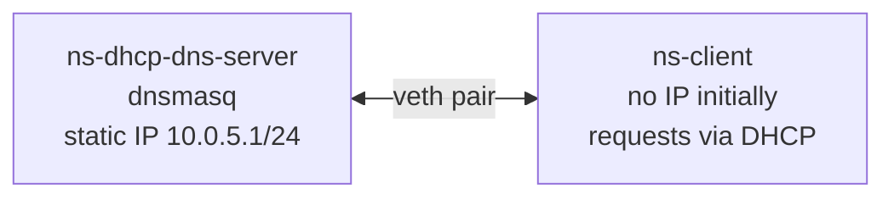
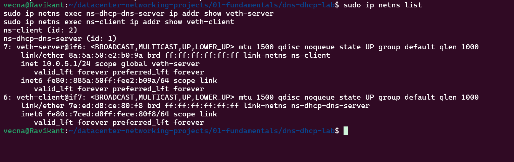
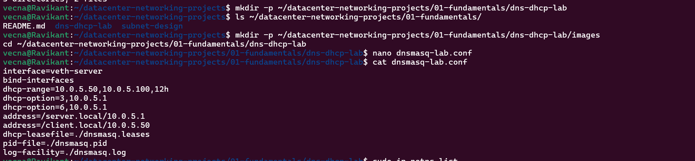
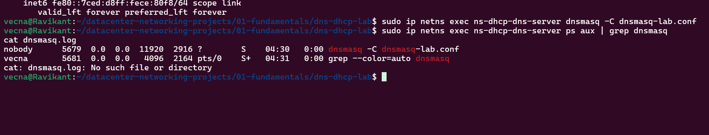
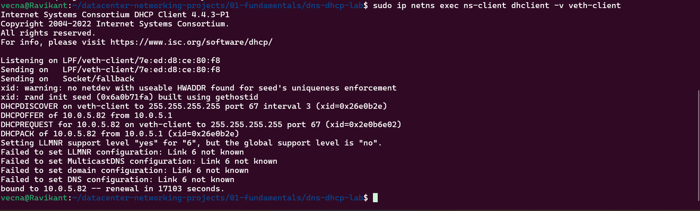
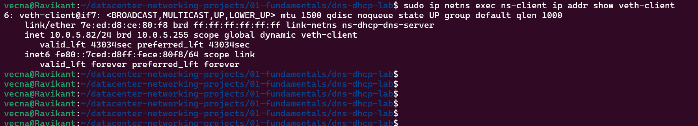
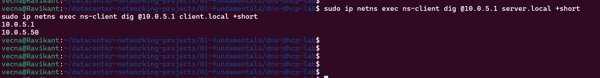
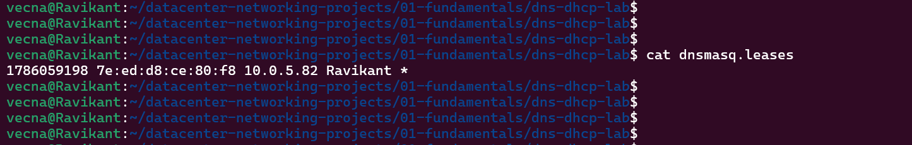

# Project 2: DNS + DHCP Lab — Linux Hands-On

**Status:** ✅ Complete
**Stack:** `dnsmasq`, Linux Network Namespaces, `dhclient`, `dig`

---

## 1. Definition

**DHCP (Dynamic Host Configuration Protocol)** is a network protocol that automatically
assigns IP addresses, default gateway, and DNS server information to devices when they
connect to a network — eliminating manual configuration.

**DNS (Domain Name System)** translates human-readable hostnames (e.g. `server.local`)
into machine-readable IP addresses (e.g. `10.0.5.1`), since computers communicate using
numbers, not names.

## 2. Use Case

Every device on a real network — office, cloud, or data center — needs both. DHCP is
how servers/hosts get provisioned with an address automatically at scale (core to IPAM —
IP Address Management), and DNS is how internal services find each other by name rather
than by memorized IP. This lab uses `dnsmasq`, a lightweight tool that serves both DHCP
and DNS together — commonly used in real small/medium production infrastructure, not
just as a teaching tool.

## 3. Architecture



Two Linux network namespaces connected by a single `veth` pair (virtual cable). The
server namespace runs `dnsmasq` bound to its interface; the client namespace starts with
no IPv4 address and obtains one dynamically via DHCP, then resolves hostnames via DNS —
both served by the same `dnsmasq` process.

**IP addressing plan:**
| Range | Purpose |
|---|---|
| `10.0.5.1` | Server — static, reserved (standard convention: infrastructure gets `.1`) |
| `10.0.5.2` – `10.0.5.49` | Reserved gap for future static devices |
| `10.0.5.50` – `10.0.5.100` | DHCP pool — dynamically assigned to clients |
| `10.0.5.101` – `10.0.5.254` | Reserved for future growth |

---

## Steps

### Step 1 — Install required tools

```bash
sudo apt update
sudo apt install -y dnsmasq isc-dhcp-client dnsutils
```

- `dnsmasq` → combined DHCP + DNS server
- `isc-dhcp-client` → provides `dhclient`, used by the client namespace to request an IP
- `dnsutils` → provides `dig`, used to test DNS resolution

### Step 2 — Stop the system-wide dnsmasq service

Ubuntu's `systemd-resolved` already listens on port 53 by default. Rather than fight
that, the system-wide `dnsmasq` service is stopped since this lab runs its own instance
manually inside an isolated network namespace — which has its own port 53, completely
separate from the host's.

```bash
sudo systemctl stop dnsmasq
sudo systemctl disable dnsmasq
```

### Step 3 — Create namespaces and connect them with a veth pair

```bash
sudo ip netns add ns-dhcp-dns-server
sudo ip netns add ns-client

sudo ip link add veth-server type veth peer name veth-client
sudo ip link set veth-server netns ns-dhcp-dns-server
sudo ip link set veth-client netns ns-client
```

### Step 4 — Assign a static IP to the server; bring up the client interface (no IP yet)

```bash
sudo ip netns exec ns-dhcp-dns-server ip addr add 10.0.5.1/24 dev veth-server
sudo ip netns exec ns-dhcp-dns-server ip link set veth-server up
sudo ip netns exec ns-dhcp-dns-server ip link set lo up

sudo ip netns exec ns-client ip link set veth-client up
sudo ip netns exec ns-client ip link set lo up
```

**Verified:**
```
ns-dhcp-dns-server:  inet 10.0.5.1/24  dev veth-server   state UP
ns-client:           (no inet — only IPv6 link-local)    state UP
```



The server gets a fixed address (a DHCP/DNS server must be at a known, predictable
address). The client is deliberately left without an IPv4 address — that's what DHCP
will provide next.

### Step 5 — dnsmasq configuration (`dnsmasq-lab.conf`)

```
interface=veth-server
bind-interfaces
dhcp-range=10.0.5.50,10.0.5.100,12h
dhcp-option=3,10.0.5.1
dhcp-option=6,10.0.5.1
address=/server.local/10.0.5.1
address=/client.local/10.0.5.50
dhcp-leasefile=./dnsmasq.leases
pid-file=./dnsmasq.pid
log-facility=./dnsmasq.log
```

| Line | Purpose |
|---|---|
| `interface` / `bind-interfaces` | Restrict dnsmasq to only the lab's veth interface, avoiding conflicts with the host's real network |
| `dhcp-range` | The pool of addresses handed to clients, with a 12-hour lease |
| `dhcp-option=3` | Option 3 = default gateway, advertised to clients |
| `dhcp-option=6` | Option 6 = DNS server, advertised to clients |
| `address=/server.local/...` / `address=/client.local/...` | Custom DNS entries (A-record equivalent) |
| `dhcp-leasefile` / `pid-file` / `log-facility` | Kept inside the project folder so the lab is self-contained and doesn't touch system-wide files |



### Step 6 — Start dnsmasq inside the server namespace

```bash
sudo ip netns exec ns-dhcp-dns-server dnsmasq -C dnsmasq-lab.conf
```

**Verified running:**
```
$ sudo ip netns exec ns-dhcp-dns-server ps aux | grep dnsmasq
nobody   5679  0.0  0.0  11920  2916 ?  S  04:30  0:00 dnsmasq -C dnsmasq-lab.conf
```



### Step 7 — Client requests an IP via DHCP (DORA process)

```bash
sudo ip netns exec ns-client dhclient -v veth-client
```

**Result — the full DORA exchange, live:**
```
DHCPDISCOVER on veth-client to 255.255.255.255 port 67 interval 3 (xid=0x26e0b2e)
DHCPOFFER of 10.0.5.82 from 10.0.5.1
DHCPREQUEST for 10.0.5.82 on veth-client to 255.255.255.255 port 67 (xid=0x2e0b6e02)
DHCPACK of 10.0.5.82 from 10.0.5.1 (xid=0x26e0b2e)
bound to 10.0.5.82 -- renewal in 17103 seconds.
```



- **D**iscover — client broadcasts "is any DHCP server here? I need an IP"
- **O**ffer — server offers `10.0.5.82` (from the configured pool)
- **R**equest — client formally requests that specific IP
- **A**cknowledge — server confirms the lease

`10.0.5.82` falls correctly within the configured pool (`10.0.5.50`–`10.0.5.100`).

### Step 8 — Verify the client's assigned IP

```bash
sudo ip netns exec ns-client ip addr show veth-client
```

**Result:**
```
inet 10.0.5.82/24 brd 10.0.5.255 scope global dynamic veth-client
   valid_lft 43034sec preferred_lft 43034sec
```



The `dynamic` keyword confirms this address came from DHCP, not manual configuration —
the key difference from Project 1, where the IP was set statically.

### Step 9 — Test DNS resolution

```bash
sudo ip netns exec ns-client dig @10.0.5.1 server.local +short
sudo ip netns exec ns-client dig @10.0.5.1 client.local +short
```

**Result:**
```
server.local  →  10.0.5.1
client.local  →  10.0.5.50
```



Both hostnames resolved correctly against the configured DNS entries. (Note:
`client.local` returns the value hardcoded in the config, `10.0.5.50` — a separate,
manually-defined DNS entry, independent of whatever IP the client actually receives
dynamically via DHCP, `10.0.5.82` in this run.)

### Step 10 — Verify the DHCP lease record (server-side)

```bash
cat dnsmasq.leases
```

**Result:**
```
1786059198 7e:ed:d8:ce:80:f8 10.0.5.82 Ravikant *
```



This is the server's own record of the lease it granted — the MAC address
(`7e:ed:d8:ce:80:f8`) and IP (`10.0.5.82`) match exactly what was seen on the client
side, confirming the DHCP transaction end-to-end.

---

## Cleanup

```bash
sudo pkill dnsmasq
sudo ip netns del ns-dhcp-dns-server
sudo ip netns del ns-client
rm -f dnsmasq.leases dnsmasq.pid dnsmasq.log
```

---

## 4. Key Learnings / Interview Talking Points

- Configured a combined DHCP + DNS server (`dnsmasq`) from scratch, including scope
  design with deliberate address reservations for future static devices — the same
  planning discipline applied in Project 1's VLSM design.
- Observed and can explain the full DORA process (Discover, Offer, Request, Acknowledge)
  from live client-side output, not just from a diagram.
- Distinguished static vs. dynamic addressing at the `ip addr` output level (`dynamic`
  keyword, lease timers).
- Verified DNS resolution using `dig` against a specific DNS server, and cross-verified
  a DHCP lease record against client-side interface data.
- Understands why DHCP options 3 and 6 matter — a device needs more than an IP: it
  needs a gateway and a DNS resolver to be actually useful on a network.

## 5. Tools Used

`dnsmasq`, `dhclient` (isc-dhcp-client), `dig` (dnsutils), `iproute2` (`ip netns`,
`ip link`, `ip addr`), `ps`

## 6. Next Step

Project 3: NAT & Basic Firewall/ACL Lab — building on this same namespace pattern to
control and translate traffic at the network edge.
